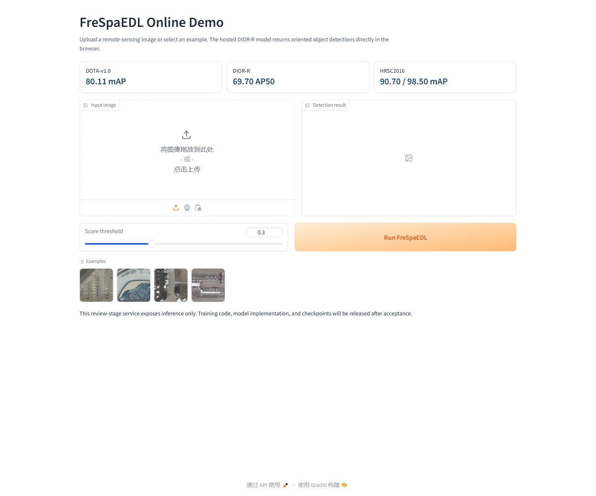

# FreSpaEDL

Official review-stage project page for **Frequency-Spatial Domain Collaborative Evidence Deep Learning for Remote Sensing Object Detection**.

> The complete training code, evaluation code, model configurations, and pretrained checkpoints will be released upon acceptance and no later than publication. They are intentionally withheld during double-blind review.

**[Open the results page](https://gzhengyang.github.io/FreSpaEDL/)** · **[Run FreSpaEDL online](https://gzhengyang--frespaedl-online-demo-web.modal.run/)**

## Live demo

Upload an aerial image or select a supplied example to run the hosted DIOR-R model. The browser returns oriented detections without requiring a local environment.

**[Launch the interactive FreSpaEDL demo →](https://gzhengyang--frespaedl-online-demo-web.modal.run/)**

Only the inference interface is public during double-blind review. The model implementation and checkpoint remain server-side.

## Results

| Dataset | Protocol | Result |
|---|---|---:|
| DOTA-v1.0 | single-scale training and testing | 80.11 mAP |
| DIOR-R | held-out test split | 69.70 AP50 |
| HRSC2016 | VOC 2007 metric | 90.70 mAP |
| HRSC2016 | VOC 2012 metric | 98.50 mAP |

Few-shot DIOR results:

| Shots | Base AP | Novel AP |
|---:|---:|---:|
| 5 | 76.2 | 44.0 |
| 10 | 75.5 | 46.1 |
| 20 | 75.8 | 56.6 |

## Release plan

Upon acceptance, this repository will add:

1. the complete FreSpaEDL training and evaluation implementation;
2. configurations for DOTA-v1.0, DIOR-R, and HRSC2016;
3. pretrained checkpoints and integrity records;
4. dataset preparation instructions;
5. commands and logs needed to reproduce the reported tables and figures.

## Acknowledgements

FreSpaEDL is developed on the open-source MMRotate and LSKNet ecosystems. Full dependency, license, and reproducibility information will accompany the post-acceptance code release.
